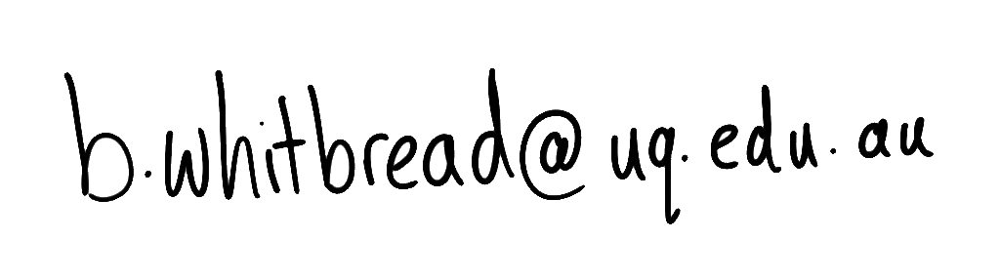

### About

Test

I am an Australian graduate student in mathematics. My [CV](files/CV.pdf) (April 2024). My [GitHub](https://github.com/baileywhitbread). 

{width="100%"}\
([Heron Island](https://photos.app.goo.gl/nkzB7aQbcKBTcio57), 2021)

### Contact

Address: [School of Mathematics and Physics](https://smp.uq.edu.au/),\
[The University of Queensland](https://www.uq.edu.au/),\
[St Lucia, QLD, 4072,
Australia](https://en.wikipedia.org/wiki/St_Lucia,_Queensland).\
Office: Building 69 Room 714.\
Email:

{width="50%"}

### Maths

My advisors are [Masoud
Kamgarpour](https://sites.google.com/site/masoudkomi/home) and [Ole
Warnaar](https://people.smp.uq.edu.au/OleWarnaar/). 

Previous advisors and mentors include [Anna Puskás](https://people.smp.uq.edu.au/AnnaPuskas/), [Ramiro Lafuente](https://sites.google.com/view/ramlaf/home) and [Valentin Buciumas](https://sites.google.com/site/valentinbuciumas/home).

Broadly, I am interested in representation theory, geometry, and combinatorics. Specific topics include finite
groups of Lie type, Coxeter groups and Iwahori–Hecke algebras. I am currently researching character varieties associated to arbitrary reductive groups. 

I am also interested in computational aspects of all of the above. For example, I often use the [Chevie package](https://jmichel7.github.io/Chevie.jl/) for Julia.

For a visual explanation of my masters project, I created a poster about the [Topology of Representation Spaces via Arithmetic](files/23_poster.pdf).

My undergraduate thesis was about [Hecke Algebras and Gelfand Pairs in
Representation Theory](files/21_honours_thesis.pdf).

### Service and Work
-   Co-organiser for the UQ SMP Graduate Student Seminar (2023-2024).
-   Co-organiser for a [lecture series on the Weil conjectures](https://sites.google.com/view/weiltoomuchfun/) (2023). Notes are [here](https://www.dropbox.com/s/7wrwzmgfq5jce2r/Weil%20Conjecture%20Notes.pdf).
-   Marker for the [Simon Marais Mathematics
    Competition](https://www.simonmarais.org) (2022).
-   Marker for the [UQ/QAMT Problem Solving
    Competition](https://qamt.qld.edu.au/problem-solving-competition/)
    (2022).
-   Marker of final exams for UQ (2021 - now).
-   Drafter for the annual UQ SMP Maths Relay (2021 - now).
-   Research assistant (drafting manuscripts with students) at UQ (2021).
-   Tutor for the [UQ Queensland Mathematics Summer
    School](https://smp.uq.edu.au/event/4364/queensland-mathematics-summer-school)
    (2019).
-   President and vice president of the [UQ Mathematics Students
    Society](https://www.facebook.com/uqmss) (2017 - 2019).

I have tutored at UQ for the following courses:

-   2024:
    [MATH3303](https://my.uq.edu.au/programs-courses/course.html?course_code=MATH3303), [MATH1071](https://my.uq.edu.au/programs-courses/course.html?course_code=MATH1061) (lead tutor).
-   2023:
    [MATH3303](https://my.uq.edu.au/programs-courses/course.html?course_code=MATH3303), [MATH1061](https://my.uq.edu.au/programs-courses/course.html?course_code=MATH1061) (lead tutor and lecture tutor).
-   2022:
    [MATH3303](https://my.uq.edu.au/programs-courses/course.html?course_code=MATH3303),
    [MATH2401](https://my.uq.edu.au/programs-courses/course.html?course_code=MATH2401)
    (lead tutor),
    [MATH2301](https://my.uq.edu.au/programs-courses/course.html?course_code=MATH2301),
    [MATH2001](https://my.uq.edu.au/programs-courses/course.html?course_code=MATH2001).
-   2021:
    [MATH3303](https://my.uq.edu.au/programs-courses/course.html?course_code=MATH3303),
    [MATH2401](https://my.uq.edu.au/programs-courses/course.html?course_code=MATH2401),
    [MATH2001](https://my.uq.edu.au/programs-courses/course.html?course_code=MATH2001),
    [MATH1061](https://my.uq.edu.au/programs-courses/course.html?course_code=MATH1061),
    [First Year Learning
    Centre](https://smp.uq.edu.au/current-students/first-year-learning-centres).
-   2020:
    [MATH2400](https://my.uq.edu.au/programs-courses/course.html?course_code=MATH2400),
    [MATH1071](https://my.uq.edu.au/programs-courses/course.html?course_code=MATH1071),
    [MATH1061](https://my.uq.edu.au/programs-courses/course.html?course_code=MATH1061),
    [MATH1051](https://my.uq.edu.au/programs-courses/course.html?course_code=MATH1051).\
-   2019:
    [MATH1061](https://my.uq.edu.au/programs-courses/course.html?course_code=MATH1061),
    [MATH1052](https://my.uq.edu.au/programs-courses/course.html?course_code=MATH1052),
    [MATH1051](https://my.uq.edu.au/programs-courses/course.html?course_code=MATH1051).\
    
### Talks

-   [Polynomials in the variable $p$](files/24_amsi_talk.pdf) (AMSI Summer School, Jan 2024).
-   [Character Varieties in Arbitrary Type](files/23_austms_talk.pdf) (AustMS Conference, Dec 2023).
-   [Arithmetic Geometry of Representation Spaces](files/23_glasgow.pdf) (Glasgow Algebra and Number Theory Seminar, Sep 2023).
-   Groups and Shadows (For [MSS](https://www.facebook.com/uqmss), Aug and Oct 2023).
-   [Arithmetic, Geometry & Polynomials in the Variable $q$](files/23_uq_gss.pdf) (Graduate Student Seminar, July 2023).
-   [Counting Points on the Representation
    Variety](files/22_austms_talk.pdf) (AustMS Conference, Dec 2022). \
-   [The Representation Variety and its
    E-Polynomial](files/22_amsi_talk.pdf) (AMSI Winter School, Jun 2022).
-   [Hecke Algebras and Gelfand Pairs in Representation
    Theory](files/21_honours_talk.pdf) (Honours Final Talk, May 2021).
-   [Kinky Sets](files/21_kinky_sets.pdf) (For [MSS](https://www.facebook.com/uqmss), Mar 2021).
-   [The Twin Prime and Elliot--Halberstam
    Conjectures](files/20_elliot_halberstam.pdf) (Coursework, Oct 2020).
-   The Dirichlet Function (For
    [MSS](https://www.facebook.com/uqmss), Mar 2019).

### Events, Seminars, Workshops, etc.

You may have met me at the following:

-   [AMSI Summer School 2024](https://ss.amsi.org.au/) (Jan - Feb 2024).
-   [67th Annual Meeting of the Australian Mathematical Society](https://austms2023.smp.uq.edu.au) (Dec 2023).
-   [UQ School of Mathematics and Physics Poster Day](files/poster.pdf) (Oct 2023).
-   [University of Glasgow Algebra and Number Theory Seminar](https://www.gla.ac.uk/schools/mathematicsstatistics/events/details/?id=11072) (Sep 2023).
-   [Categorified Enumerative Geometry and Representation Theory](https://sites.google.com/view/workshopepfl/home) (Sep 2023).
-   [Differential Geometry Days @ UQ](https://sites.google.com/view/ramlaf/dg-days-uq) (Feb - Mar 2023).
-   [66th Annual Meeting of the Australian Mathematical Society](https://conference.unsw.edu.au/en/austms2022) (Dec 2022).
-   [Number Theory Down Under 10](https://sites.google.com/view/ntdu10)
    (Sep 2022).
-   [AMSI Winter School 2022 - New Directions in Representation
    Theory](https://amsi.org.au/events/event/amsi-winter-school-2022-new-directions-in-representation-theory/) (Jun - Jul 2022).
-   [ANU Character Varieties, E-Polynomials and Representation Zeta
    Functions
    Workshop](https://maths.anu.edu.au/news-events/events/character-varieties-e-polynomials-and-representation-zeta-functions)
    (Feb 2022).
-   [UQ Maths North Stradbroke Island Workshop on Character
    Varieties](files/21_character_varieties.pdf) (Dec 2021).
-   [UQ Maths Heron Island Workshop on Geometry and Representation
    Theory](https://sites.google.com/view/hiwgrt/home) (Jun - Jul 2021).
-   UQ Maths North Stradbroke Island Workshop (Feb - Mar 2021).
-   ['What is...?' (Wise)
    Seminar](https://sites.google.com/view/mathwise) (2021 - 2022).
-   [AMSI Summer School 2021](https://amsi.org.au/wp-content/uploads/2021/12/2.-amsi-samw-summer-school-2021-report.pdf) (Jan - Feb 2021).
-   [Simon Marais Mathematics Competition](https://www.simonmarais.org)
    (2018 - 2019).

### About Me
-   I play Tetris.
    -   [Me](https://ch.tetr.io/u/qbailey) on
        [TETR.IO](https://tetr.io/).
    -   Other Tetris versions that I play:
        -   [NES Tetris](files/tetris.nes) (right-click -\> 'Save as...'
            -\> tetris.nes, play this file with
            [Mesen](https://www.mesen.ca/)),
        -   [NullpoMino](https://github.com/nullpomino/nullpomino),
        -   [Jstris](https://jstris.jezevec10.com/).
    -   Some very bad scores:
        -   TETR.IO, 40L race,
            [1:00.197](https://tetr.io/#r:61b440fd551f6403891aab5c)
            (2022).
        -   TETR.IO, Blitz, [100,490](https://tetr.io/#R:ALZPXOJjc)
            (2022).
        -   NES Tetris, Level 15 Start, [513,900](files/24_nes_L15.png)
            (2024),
        -   NES Tetris, Level 18 Start, [430,193](files/18_nes_L18.png)
            (2018).
-   I've played [Geoguessr](https://www.geoguessr.com/).
    -   10 seconds no moving, panning or zooming,
        [20,802](https://www.geoguessr.com/results/VKSszaWqFh68td7r)
        (2023).
-   Member of [Urban Climb](https://www.urbanclimb.com.au/) (2021 -
    now).
-   Member of [SSAA](https://ssaa.org.au/) (2019 - now).
    -   [Metallic Silhouette](https://www.ssaa.org.au/disciplines/all-disciplines/rifle-metallic-silhouette/) Cowboy Rifle Lever Action.
        -   Centerfire Grade AA.
        -   Rimfire Grade A.
        
### This site
I made this site with [R Markdown](https://rmarkdown.rstudio.com) and published it using [Netlify](https://www.netlify.com).

### Photos

#### 2023
[67th Annual Meeting of the Australian Mathematical Society](https://austms.org.au/event/austms-2023/), Brisbane, Australia
[[1]](files/23_austms.jpg){width="100%"}\
[University of Glasgow, Algebra and Number Theory Seminar](https://www.gla.ac.uk/schools/mathematicsstatistics/events/details/?id=11072), Glasgow, Scotland
[[1]](files/23_Glasgow.png){width="100%"}\
[Categorified Enumerative Geometry and Representation Theory](https://sites.google.com/view/workshopepfl/home), Lausanne, Switzerland
[[1]](files/23_EPFL.png){width="100%"}

#### 2022 
[66th Annual Meeting of the Australian Mathematical Society](https://austms.org.au/event/austms-2022/), Sydney, Australia
[[1]](files/22_austms.jpg){width="100%"}\
[AMSI Winter School](https://amsi.org.au/events/event/amsi-winter-school-2022-new-directions-in-representation-theory/), Brisbane, Australia
[[1]](files/22_amsi.png){width="100%"}

#### 2021 
UQ Representation Theory Day, Brisbane, Australia
[[1]](files/21_repday.png){width="100%"}\
[Heron Island Workshop on Geometry and Representation Theory](https://sites.google.com/view/hiwgrt), Heron Island, Australia [[1]](files/21_heron.png){width="100%"} [[2]](files/21_me_heron.png){width="100%"}\
